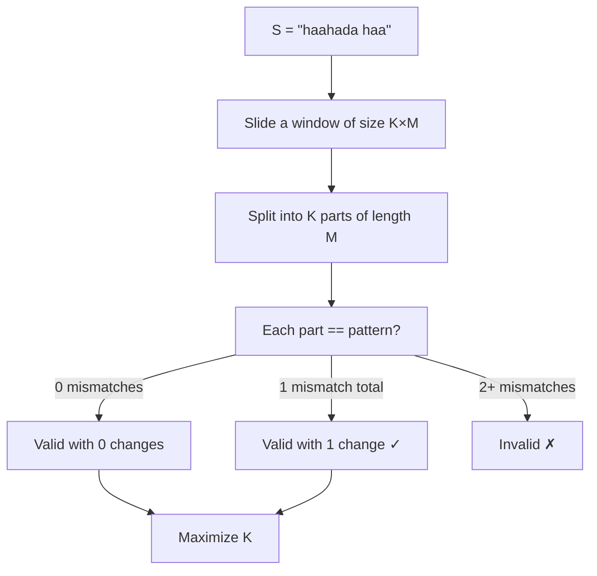
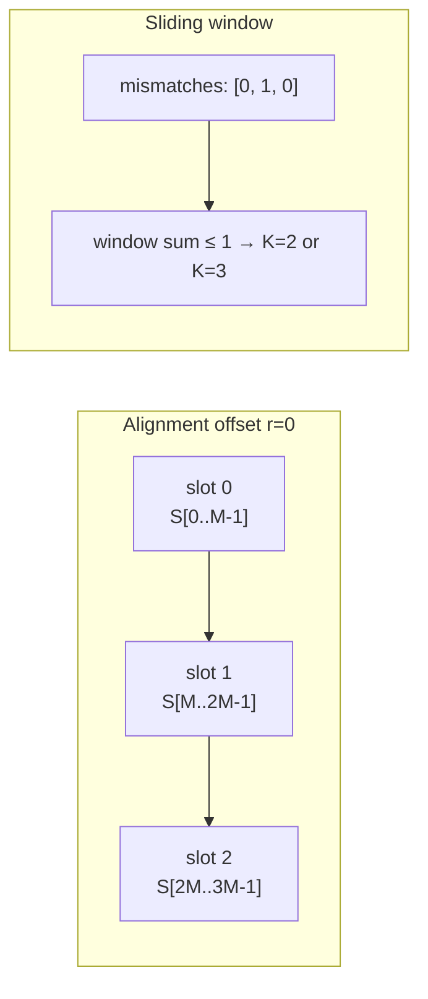

import { Callout } from 'fumadocs-ui/components/callout';
import { Accordion, Accordions } from 'fumadocs-ui/components/accordion';
import { Step, Steps } from 'fumadocs-ui/components/steps';
import { Tab, Tabs } from 'fumadocs-ui/components/tabs';

# Problem H — Change a Character

> **Game of Codes 4** · INSEA, Rabat, Morocco · February 08, 2026

**Mouad** picked up this problem during the contest and made some progress, but we couldn't close it in time. It looks deceptively simple — strings, pattern matching — but the "at most one character change" twist adds a layer that bit us.

<Callout type="warn">
  We didn't solve this one during the contest. This is our post-contest analysis of the correct approach.
</Callout>

---

## Problem Statement

Given a string $$S$$ of length $$N$$ and a string *pattern* of length $$M$$, find the maximum $$K$$ such that $$S$$ contains a substring made of **$$K$$ consecutive copies** of *pattern*.

You are allowed to **change at most one character** in $$S$$ to help form this substring.

The substring must satisfy:
- Total length is $$K \times M$$
- When split into $$K$$ adjacent parts of length $$M$$, each part is identical to *pattern*

Output the maximum possible $$K$$.

### Constraints

$$1 \leq t \leq 10^4$$, $$1 \leq N, M \leq 10^5$$, sum of $$N$$ and sum of $$M$$ over all test cases each $$\leq 10^5$$

---

## Understanding the Problem



The key insight: we're not changing the pattern — we're changing **one character of S** to make a window of $$K \times M$$ characters match *pattern* repeated $$K$$ times.

---

## Key Insight

<Callout type="info">
For a fixed starting position $$i$$ in $$S$$, and a fixed $$K$$, the window $$S[i \ldots i + K \cdot M - 1]$$ is valid if the **total number of character mismatches** against `pattern * K` is **at most 1**.

This lets us think in terms of **mismatch counting** rather than exact matching.
</Callout>

For a window starting at position $$i$$ covering $$K$$ copies of pattern, define:

```math
\text{mismatches}(i, K) = \sum_{j=0}^{K \cdot M - 1} \mathbf{1}\left[S[i+j] \neq \text{pattern}[j \bmod M]\right]
```

We want the maximum $$K$$ such that there exists an $$i$$ where $$\text{mismatches}(i, K) \leq 1$$.

---

## Approach: Sliding Window on Pattern Slots

Instead of sliding character by character, think in units of **one pattern length $$M$$**.

<Steps>
  <Step>
    **Precompute mismatch count per slot** — for each starting position $$i$$ in $$S$$ that is a multiple of $$M$$... wait, the window can start anywhere. We need to handle arbitrary starting positions.
  </Step>
  <Step>
    **For each possible start mod M offset $$r \in [0, M)$$** — fix the alignment offset. Within this alignment, positions $$r, r+M, r+2M, \ldots$$ each start a "slot". Compute the mismatch count for each slot independently.
  </Step>
  <Step>
    **Sliding window on slot mismatch counts** — now use a sliding window over consecutive slots, expanding as long as total mismatches $$\leq 1$$. The window size in slots = $$K$$.
  </Step>
  <Step>
    **Track the maximum $$K$$** across all alignments.
  </Step>
</Steps>



---

## Mismatch Count per Slot

For alignment offset $$r$$ and slot index $$k$$, the slot starts at position $$r + k \cdot M$$ in $$S$$:

```math
\text{slot\_miss}[k] = \sum_{j=0}^{M-1} \mathbf{1}\left[S[r + k \cdot M + j] \neq \text{pattern}[j]\right]
```

Each slot has a mismatch count in $$\{0, 1, 2, \ldots, M\}$$. For our sliding window we only care whether it's 0, 1, or $$\geq 2$$.

The sliding window then finds the longest contiguous subsequence of slots with **sum of mismatch counts $$\leq 1$$**.

---

## Walkthrough of Examples

<Accordions>
  <Accordion title='Example 1a — S="hassa", pattern="ha" → K=1'>

Pattern length $$M = 2$$. Try alignment $$r = 0$$:

| Slot | Substring | Mismatches vs "ha" |
|------|-----------|-------------------|
| 0    | `ha`      | 0                 |
| 1    | `ss`      | 2                 |
| 2    | `a`       | (partial, skip)   |

Window `[0]`: sum = 0 ≤ 1 → K=1 ✓  
Window `[0,1]`: sum = 2 > 1 → invalid

Try alignment $$r = 1$$:

| Slot | Substring | Mismatches vs "ha" |
|------|-----------|-------------------|
| 0    | `as`      | 2                 |
| 1    | `sa`      | 2                 |

No improvement. Maximum $$K = 1$$.

  </Accordion>

  <Accordion title='Example 1b — S="haahada haa", pattern="haa" → K=2'>

Pattern $$M = 3$$. Alignment $$r = 0$$:

| Slot | Substring | Mismatches vs "haa" |
|------|-----------|---------------------|
| 0    | `haa`     | 0                   |
| 1    | `had`     | 1                   |
| 2    | `a h`     | 2                   |

Window `[0,1]`: sum = 1 ≤ 1 → K=2 ✓ (change `d` → `a` in S)  
Window `[0,1,2]`: sum = 3 > 1 → invalid

Maximum $$K = 2$$.

  </Accordion>

  <Accordion title='Example 2 — S="domdom", pattern="dom" → K=2'>

Pattern $$M = 3$$. Alignment $$r = 0$$:

| Slot | Substring | Mismatches vs "dom" |
|------|-----------|---------------------|
| 0    | `dom`     | 0                   |
| 1    | `dom`     | 0                   |

Window `[0,1]`: sum = 0 ≤ 1 → K=2 ✓

Maximum $$K = 2$$.

  </Accordion>
</Accordions>

---

## Implementation

<Tabs items={['Python', 'C++']}>
  <Tab value="Python">
```python
import sys
input = sys.stdin.readline

def solve():
    N, M = map(int, input().split())
    line = input().split()
    S, pattern = line[0], line[1]

    best = 0

    for r in range(M):
        # collect mismatch counts for each full slot at this alignment
        misses = []
        pos = r
        while pos + M <= N:
            cnt = sum(1 for j in range(M) if S[pos + j] != pattern[j])
            misses.append(cnt)
            pos += M

        # sliding window: max contiguous subarray with sum <= 1
        total = 0
        left = 0
        for right in range(len(misses)):
            total += misses[right]
            while total > 1:
                total -= misses[left]
                left += 1
            best = max(best, right - left + 1)

    print(best)

t = int(input())
for _ in range(t):
    solve()
```
  </Tab>
  <Tab value="C++">
```cpp
#include <bits/stdc++.h>
using namespace std;

int main() {
    ios::sync_with_stdio(false);
    cin.tie(nullptr);

    int t;
    cin >> t;

    while (t--) {
        int N, M;
        cin >> N >> M;
        string S, pattern;
        cin >> S >> pattern;

        int best = 0;

        for (int r = 0; r < M; r++) {
            vector<int> misses;
            int pos = r;
            while (pos + M <= N) {
                int cnt = 0;
                for (int j = 0; j < M; j++)
                    if (S[pos + j] != pattern[j]) cnt++;
                misses.push_back(cnt);
                pos += M;
            }

            int total = 0, left = 0;
            for (int right = 0; right < (int)misses.size(); right++) {
                total += misses[right];
                while (total > 1) {
                    total -= misses[left++];
                }
                best = max(best, right - left + 1);
            }
        }

        cout << best << '\n';
    }

    return 0;
}
```
  </Tab>
</Tabs>

---

## Complexity

- **Per test case:** $$O(N \cdot M / M) = O(N)$$ slots per alignment, $$O(M)$$ alignments → $$O(N)$$ total slots, each costing $$O(M)$$ to compute mismatches → **$$O(N \cdot M)$$ naively**
- **With prefix sums or rolling:** can be brought to $$O(N)$$ per test case

<Callout type="warn">
  With $$N, M \leq 10^5$$ and sum of $$N$$, sum of $$M$$ each $$\leq 10^5$$, the naive $$O(N \cdot M)$$ per case is actually fine in aggregate — but only because the constraint is on the **sum**, not individual values. If a single case had $$N = M = 10^5$$, this would be $$10^{10}$$ — TLE. Read constraints carefully!
</Callout>

---

## Where Mouad Got Stuck

<Accordions>
  <Accordion title="Trying to fix the window at position 0">
    The first instinct is to only try alignment $$r = 0$$, i.e., windows starting at multiples of $$M$$. But the problem allows the substring to start **anywhere** in $$S$$ — so we must try all $$M$$ possible alignment offsets.
  </Accordion>

  <Accordion title="Counting mismatches globally instead of per slot">
    A mismatch count over the entire window conflates which character to change. The per-slot decomposition makes it clear: each slot independently tells you how many fixes it needs, and the sliding window gives you the optimal contiguous range.
  </Accordion>

  <Accordion title="Off-by-one on partial slots">
    When $$r > 0$$, the last slot might not fit fully before the end of $$S$$. The `while pos + M <= N` guard handles this — partial trailing slots are simply skipped.
  </Accordion>
</Accordions>

---

## Reflection

This problem has an elegant structure once you see the alignment + sliding window decomposition. The "at most one change" constraint maps perfectly to a classic sliding window with a budget of 1 — the same idea as *Longest Subarray with At Most K Replacements*. Mouad was on the right track thinking about windows; the missing piece was iterating over all $$M$$ alignment offsets.

<Callout type="info">
  **Lesson:** When a string problem involves a repeating pattern, always think about alignment. The $$M$$ possible starting offsets are often the key dimension that unlocks the solution.
</Callout>

---

*Part of our [Game of Codes 4](/blogs/game-of-codes) series — see the main article for the full contest recap.*