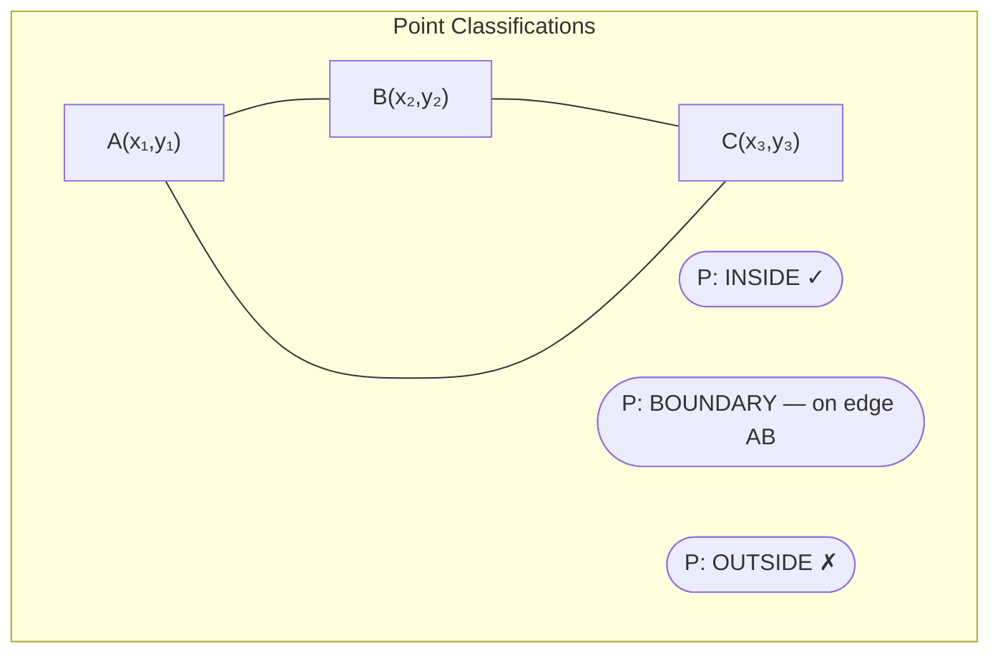
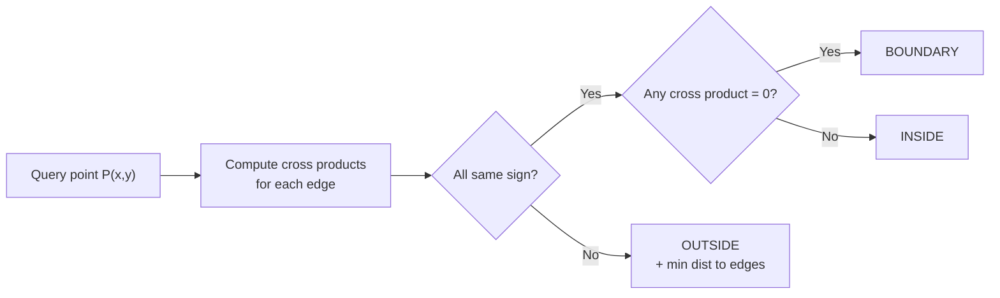

import { Callout } from 'fumadocs-ui/components/callout';
import { Accordion, Accordions } from 'fumadocs-ui/components/accordion';
import { Step, Steps } from 'fumadocs-ui/components/steps';
import { Tab, Tabs } from 'fumadocs-ui/components/tabs';

# Problem I — Triangle Transformation

> **Game of Codes 4** · INSEA, Rabat, Morocco · February 08, 2026

This was the hardest problem our team faced. **Khalil** spent most of the contest grinding through the geometry — he got tantalizingly close, but we ultimately couldn't land a clean AC. This writeup is our post-contest breakdown of the full correct approach.

<Callout type="warn">
  We didn't solve this one during the contest. What follows is our reconstruction of the correct solution after the fact — a learning exercise more than a victory lap.
</Callout>

---

## Problem Statement

You are given a triangle with vertices $$A(x_1, y_1)$$, $$B(x_2, y_2)$$, and $$C(x_3, y_3)$$ on a 2D coordinate plane. For each of $$Q$$ queries, you are given a point $$P(x, y)$$ and must determine:

1. Whether $$P$$ lies **strictly inside**, on the **boundary**, or **outside** the triangle
2. If $$P$$ is outside, the **minimum distance** from $$P$$ to any point on the triangle (edges + vertices)

### Output per query

- `INSIDE` — $$P$$ is strictly inside the triangle
- `BOUNDARY` — $$P$$ lies on any edge or vertex
- `OUTSIDE` — $$P$$ is outside (+ minimum distance, but this part wasn't explicitly in the sample output — classification only shown)

### Constraints

$$-10^6 \leq x_i, y_i \leq 10^6$$, $$1 \leq Q \leq 10^5$$, time limit: 2 seconds

---

## The Geometry at a Glance

Before diving into math, let's visualize what we're dealing with:





---

## Key Insight: Cross Product Sign Test

<Callout type="info">
The most robust way to classify a point relative to a triangle is the **cross product (signed area) method** — no division, no floating point trig, works perfectly with integer coordinates.
</Callout>

For a directed edge from $$P_1$$ to $$P_2$$, the cross product with point $$P$$ is:

```math
d(P_1, P_2, P) = (P_2 - P_1) \times (P - P_1) = (x_2 - x_1)(y - y_1) - (y_2 - y_1)(x - x_1)
```

This gives:
- $$d > 0$$ → $$P$$ is to the **left** of the directed edge
- $$d = 0$$ → $$P$$ is **on the line** through the edge
- $$d < 0$$ → $$P$$ is to the **right** of the directed edge

For triangle $$A \to B \to C$$, compute $$d_1 = d(A,B,P)$$, $$d_2 = d(B,C,P)$$, $$d_3 = d(C,A,P)$$:

```math
P \in \triangle ABC \iff \text{sign}(d_1) = \text{sign}(d_2) = \text{sign}(d_3) \neq 0
```

```math
P \in \partial\triangle ABC \iff \min(|d_1|, |d_2|, |d_3|) = 0 \text{ and all non-negative (or all non-positive)}
```

---

## Classification Algorithm

<Steps>
  <Step>
    **Compute the three cross products** $$d_1, d_2, d_3$$ using integer arithmetic — no precision issues.
  </Step>
  <Step>
    **Check signs.** If all three are strictly positive or all strictly negative → **INSIDE**.
  </Step>
  <Step>
    **Check for zeros.** If any $$d_i = 0$$ AND the others share the same sign (or are also zero) → **BOUNDARY**. This handles both edge and vertex cases.
  </Step>
  <Step>
    **Otherwise** → **OUTSIDE**. Compute the minimum distance from $$P$$ to all three edges using point-to-segment distance.
  </Step>
</Steps>

---

## The Hard Part: Point-to-Segment Distance

For the OUTSIDE case, we need the minimum distance from $$P$$ to each of the three edges $$AB$$, $$BC$$, $$CA$$.

The distance from point $$P$$ to segment $$\overline{AB}$$ is:

```math
t = \frac{(P - A) \cdot (B - A)}{|B - A|^2} = \frac{(x-x_1)(x_2-x_1) + (y-y_1)(y_2-y_1)}{(x_2-x_1)^2 + (y_2-y_1)^2}
```

Then clamp $$t$$ to $$[0, 1]$$ and find the closest point $$Q$$ on the segment:

```math
Q = A + \text{clamp}(t, 0, 1) \cdot (B - A)
```

```math
\text{dist}(P, \overline{AB}) = |P - Q| = \sqrt{(x - Q_x)^2 + (y - Q_y)^2}
```

The final answer is $$\min(\text{dist}(P, AB),\ \text{dist}(P, BC),\ \text{dist}(P, CA))$$.

<Callout type="warn">
  This is where floating point becomes unavoidable. Use `double` (or `long double` for safety) only at the final distance computation — keep all classification logic in integers.
</Callout>

---

## Walkthrough: Example 1

Triangle: $$A(0,0)$$, $$B(4,0)$$, $$C(2,3)$$

<Accordions>
  <Accordion title="Query 1 — P(2,1) → INSIDE">

$$d_1 = d(A,B,P) = (4-0)(1-0) - (0-0)(2-0) = 4$$

$$d_2 = d(B,C,P) = (2-4)(1-0) - (3-0)(2-4) = -2 + 6 = 4$$

$$d_3 = d(C,A,P) = (0-2)(1-3) - (0-3)(2-2) = 4$$

All positive → **INSIDE** ✓

  </Accordion>

  <Accordion title="Query 2 — P(5,5) → OUTSIDE">

$$d_1 = (4)(5) - (0)(5) = 20$$

$$d_2 = (-2)(5) - (3)(1) = -13$$

Signs differ → **OUTSIDE** ✓

Min distance = $$\min(\text{dist_to } AB, \text{dist_to } BC, \text{dist_to} CA)$$

  </Accordion>

  <Accordion title="Query 3 — P(1,0) → BOUNDARY">

$$d_1 = d(A,B,P) = (4)(0) - (0)(1) = 0$$

$$d_2 = d(B,C,P) = (-2)(0) - (3)(-3) = 9 > 0$$

$$d_3 = d(C,A,P) = (-2)(-3) - (-3)(-1) = 3 > 0$$

$$d_1 = 0$$ and others are positive → $$P$$ lies on edge $$AB$$ → **BOUNDARY** ✓

  </Accordion>
</Accordions>

---

## Implementation

<Tabs items={['Python', 'C++']}>
  <Tab value="Python">
```python
import sys
import math
input = sys.stdin.readline

def cross(ax, ay, bx, by, px, py):
    return (bx - ax) * (py - ay) - (by - ay) * (px - ax)

def point_to_segment_dist(px, py, ax, ay, bx, by):
    dx, dy = bx - ax, by - ay
    if dx == 0 and dy == 0:
        return math.hypot(px - ax, py - ay)
    t = ((px - ax) * dx + (py - ay) * dy) / (dx * dx + dy * dy)
    t = max(0.0, min(1.0, t))
    qx, qy = ax + t * dx, ay + t * dy
    return math.hypot(px - qx, py - qy)

def classify(ax, ay, bx, by, cx, cy, px, py):
    d1 = cross(ax, ay, bx, by, px, py)
    d2 = cross(bx, by, cx, cy, px, py)
    d3 = cross(cx, cy, ax, ay, px, py)

    has_neg = (d1 < 0) or (d2 < 0) or (d3 < 0)
    has_pos = (d1 > 0) or (d2 > 0) or (d3 > 0)
    has_zero = (d1 == 0) or (d2 == 0) or (d3 == 0)

    if has_neg and has_pos:
        return "OUTSIDE"
    if has_zero:
        return "BOUNDARY"
    return "INSIDE"

def main():
    x1, y1, x2, y2, x3, y3 = map(int, input().split())
    Q = int(input())
    out = []
    for _ in range(Q):
        px, py = map(int, input().split())
        result = classify(x1, y1, x2, y2, x3, y3, px, py)
        out.append(result)
    print('\n'.join(out))

main()
```
  </Tab>
  <Tab value="C++">
```cpp
#include <bits/stdc++.h>
using namespace std;

typedef long long ll;
typedef double ld;

ll cross(ll ax, ll ay, ll bx, ll by, ll px, ll py) {
    return (bx - ax) * (py - ay) - (by - ay) * (px - ax);
}

ld ptSegDist(ld px, ld py, ld ax, ld ay, ld bx, ld by) {
    ld dx = bx - ax, dy = by - ay;
    if (dx == 0 && dy == 0)
        return hypot(px - ax, py - ay);
    ld t = ((px - ax) * dx + (py - ay) * dy) / (dx * dx + dy * dy);
    t = max((ld)0.0, min((ld)1.0, t));
    ld qx = ax + t * dx, qy = ay + t * dy;
    return hypot(px - qx, py - qy);
}

int main() {
    ios::sync_with_stdio(false);
    cin.tie(nullptr);
    cout << fixed << setprecision(9);

    ll x1, y1, x2, y2, x3, y3;
    cin >> x1 >> y1 >> x2 >> y2 >> x3 >> y3;

    int Q;
    cin >> Q;

    while (Q--) {
        ll px, py;
        cin >> px >> py;

        ll d1 = cross(x1, y1, x2, y2, px, py);
        ll d2 = cross(x2, y2, x3, y3, px, py);
        ll d3 = cross(x3, y3, x1, y1, px, py);

        bool hasNeg = (d1 < 0) || (d2 < 0) || (d3 < 0);
        bool hasPos = (d1 > 0) || (d2 > 0) || (d3 > 0);
        bool hasZero = (d1 == 0) || (d2 == 0) || (d3 == 0);

        if (hasNeg && hasPos) {
            ld dist = min({
                ptSegDist(px, py, x1, y1, x2, y2),
                ptSegDist(px, py, x2, y2, x3, y3),
                ptSegDist(px, py, x3, y3, x1, y1)
            });
            cout << "OUTSIDE " << dist << "\n";
        } else if (hasZero) {
            cout << "BOUNDARY\n";
        } else {
            cout << "INSIDE\n";
        }
    }

    return 0;
}
```
  </Tab>
</Tabs>

---

## Complexity

- **Per query:** $$O(1)$$ — three cross products + three segment distances, all constant time
- **Total:** $$O(Q)$$ — handles $$10^5$$ queries comfortably within the 2-second limit

---

## Where Khalil Got Stuck

<Accordions>
  <Accordion title="The boundary edge case">
    The trickiest part is correctly identifying BOUNDARY. A naive "any cross product is zero" check fails — you also need to verify the zero-cross-product point actually falls **within the segment**, not on the infinite line extension.

    The cross product equals zero anywhere on the infinite line through the edge. The clamped $$t \in [0,1]$$ check in `ptSegDist` handles this, but mixing the classification and distance logic cleanly takes care.
  </Accordion>

  <Accordion title="Integer overflow">
    Coordinates up to $$10^6$$, so a cross product can reach $$(2 \times 10^6)^2 = 4 \times 10^{12}$$ — which **overflows 32-bit int**. Must use `long long` in C++.
  </Accordion>

  <Accordion title="Orientation consistency">
    The cross product sign test assumes a consistent winding order (CW or CCW). The code handles both by checking "all same sign" rather than "all positive" — so it works regardless of how the triangle vertices are given.
  </Accordion>
</Accordions>

---

## Reflection

Geometry problems are notorious for the gap between "understanding the approach" and "getting a clean AC." Khalil understood the cross product method early — the stumbling block was the boundary case and overflow. Two issues that are easy to miss under contest pressure.

<Callout type="info">
  **Lesson learned:** For geometry problems, always write a small test harness for boundary and degenerate cases *before* submitting. The algorithmic idea is rarely the problem — the edge cases are.
</Callout>

---

*Part of our [Game of Codes 4](/blogs/game-of-codes) series — see the main article for the full contest recap.*