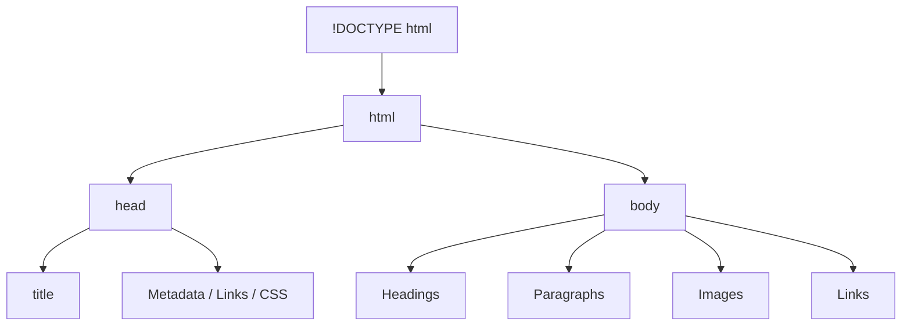
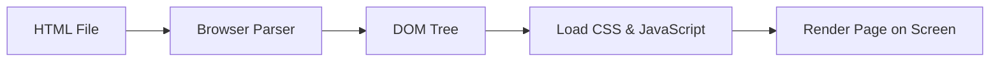

**HTML (HyperText Markup Language)** is the standard language used to create and structure content on the web. It defines the elements that make up a webpage and organizes them in a readable way for browsers.

Here’s what HTML is used for:

- **Building the structure** of a webpage — it acts as the skeleton that holds all the content.  
- **Defining elements** such as headings, paragraphs, links, images, and lists.  
- **Connecting web pages** together using hyperlinks to create a complete website.  
- **Working with CSS and JavaScript** — HTML provides the structure, CSS adds style, and JavaScript adds interactivity.  
- **Making content accessible** to both users and search engines, ensuring good readability and SEO.

In short, every website starts with HTML — it’s the foundation of everything you see on the web.

## HTML Page Structure

An **HTML page** is built using a specific structure that helps browsers understand how to display its content. Every HTML document follows a standard layout that includes several key elements:

- **`<!DOCTYPE html>`** — Declares the document type and ensures the browser interprets it as HTML5.  
- **`<html>`** — The root element that contains all the content of the web page.  
- **`<head>`** — Holds metadata such as the page title, character encoding, stylesheets, and links to external resources.  
- **`<title>`** — Defines the title shown in the browser tab.  
- **`<body>`** — Contains everything visible on the page, including text, images, links, and other elements.

This structure provides a clear foundation for organizing content and ensures that web browsers can properly render and display the page.



## Your First HTML Page

Let's create your very first HTML page! This simple example demonstrates the basic structure of an HTML document.

```html
<!DOCTYPE html>
<html>

<head>
    <title>Page Title</title>
</head>

<body>
    <h1>My First Heading</h1>
    <p>My first paragraph.</p>
</body>

</html>
```

## How Browsers Read and Compile HTML

When you open an HTML file in a web browser (like Chrome, Firefox, Safari, or Edge), the browser doesn’t actually **compile** the code like a programming language — instead, it **parses** and **renders** it.

Here’s what happens behind the scenes:

- **Read the HTML file** from top to bottom.  
- **Parse the HTML** into a structure called the **DOM (Document Object Model)** — a tree representation of all the elements on the page.  
- **Load external resources** like CSS (for styling) and JavaScript (for interactivity).  
- **Render the page** visually on the screen, applying styles and executing scripts as needed.  

So while HTML doesn’t get “compiled” into machine code, the browser effectively **translates it into a live, interactive web page** that users can see and interact with.

