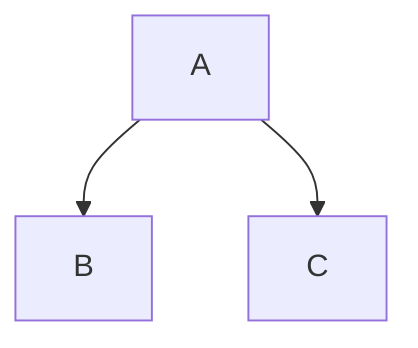

Voici un **texte normal** avec quelques variantes :

- *Texte en italique*  
- **Texte en gras**  
- ***Texte en gras et italique***  




Vous pouvez aussi combiner des styles dans une phrase, comme ceci :  
> Ce paragraphe contient du **texte normal**, du *texte en italique* et un [lien externe](https://example.com) vers un site web.

---

## Ajouter une image

Voici un exemple d’image avec un texte alternatif :


Vous pouvez aussi utiliser une image locale (si elle est dans le dossier `public/`) :

```mdx

